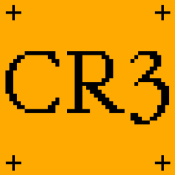
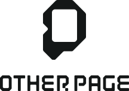

# Open Avatar Standards Working Group (OAS)

Welcome to the Open Avatar Standards Working Group repository. We aim to enable interoperable, intelligent, and expressive avatars for the open metaverse through shared protocols, tooling, and infrastructure.

## Get Involved

- Read the [Charter](./CHARTER.md)
- Join the [Discussion](https://github.com/CR3Labs/open-avatar-standards/discussions)
- Submit or review [RFCs](./rfcs/)
- [Contributing Guide](./CONTRIBUTING.md)

## Stakeholders & Contributors

&nbsp;&nbsp;&nbsp;&nbsp;

